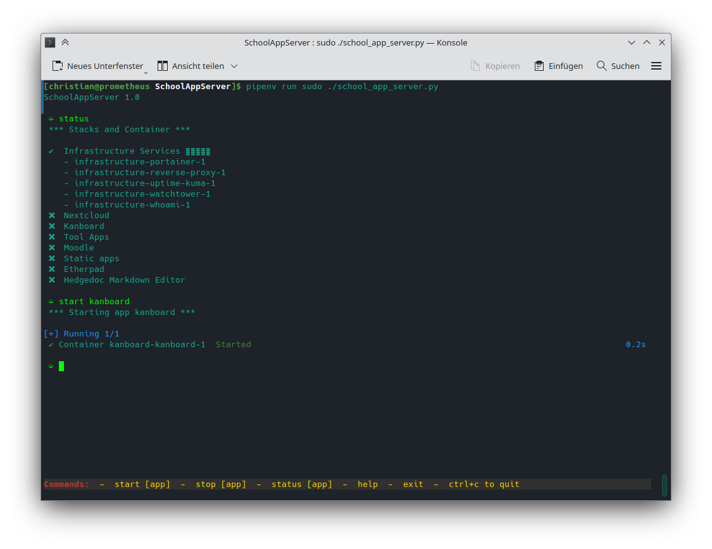

# SchoolAppServer

Provides scripts and configuration files to set up a school's app server. All
applications are deployed with Docker Compose and served by Traefik as reverse
proxy. Traefik supports HTTP/3, does SSL offloading and provides SSL
certificates from Let's Encrypt. The Docker images will be automatically
updated by Watchtower. Portainer works as management app for containers,
images, volumes, etc.

This repository provides Docker stacks containing the following services:

* Traefik - Cloud Native Application Proxy
* Portainer - Web-based container management software
* Watchtower - A solution for automating Docker container base image updates
* Uptime Kuma - A fancy self-hosted monitoring tool
* Authentik - An open-source identity provider and user management
* Grafana - Create, explore, and share data through beautiful, flexible dashboards
* Nextcloud - Self hosted open source cloud file storage
* Moodle - Open Source Learning Management System
* Kanboard - Free and open source Kanban project management software
* Jenkins - An open source automation server for CI/CD
* Gitea - Open Source Self-Hosted Git Service
* Etherpad - Real-time collaborative editor for the web
* HedgeDoc - An open-source, web-based, self-hosted, collaborative markdown editor
* draw.io - Web-based application for creating diagrams and flowcharts
* WeKan - Open-Source Kanban
* Jupyter Notebook Scientific Python Stack
* Node-RED - Low-code programming for event-driven applications
* OnlyOffice - A free and open source office and productivity suite
* Collabora Online Development Edition - A online office suite
* TeamMapper - Online tool to create and collaborate on mindmaps
* StirlingPDF - Web-based PDF manipulation tool
* Vaultwarden - Community driven web-based Bitwarden compatible password manager server
* Kiwix - Provides offline access to free educational content
* Hesk - Help Desk Software
* Homer - A very simple static homepage for your server
* Heimdall - An Application dashboard and launcher
* Dashy - A self-hostable personal dashboard built for you.
* phpMyAdmin - Web interface for MySQL and MariaDB
* Stalwart - All-in-one Mail & Collaboration server supporting every protocol (IMAP, JMAP, SMTP, CalDAV, CardDAV, WebDAV)
* Immmich - High performance self-hosted photo and video management solution

If you want something simalar, but better:

* https://github.com/MightyMoud/sidekick
* https://kamal-deploy.org

## Installation

Before using the tool you have to install all necessary packages:

    sudo apt install docker.io docker-compose-v2 git pipenv

Clone this repository:

    git clone https://github.com/wichmann/SchoolAppServer.git

To prepare the Python environment start pipenv in the cloned directory to
install all Python libraries:

    pipenv install

If the pipenv version in the repository of your distribution is too old,
please install pipenv directly with pip:

    sudo pip install --upgrade pipenv

Depending on the installed version of Python, you have to adjust the version in
the Pipfile.

## Usage

After cloning the repository you should provide the basic configuration common
to all app by entering the command 'setup':

    pipenv run ./school_app_server.py

     ➭ setup

If you use a non-root user, please use sudo to get root permissions:

    pipenv run sudo ./school_app_server.py

     ➭ setup

After that you can start and stop apps by executing the commands 'start' and
'stop'. When starting an app for the first time, you have to generate all
environment variables and secrets files. This will be done automatically.

You should start the app 'infrastructure' first, before starting any of the
other apps:

     ➭ start infrastructure

## Troubleshooting

You can execute a shell with the following command to check services inside
the Docker containers:

    docker run -it --network=infrastructure_default --rm busybox

## Demo

## Requirements

* Python 3.11 or above
* python-on-whales
* prompt-toolkit
* pyyaml
* bcrypt
* tomli (fallback for Python versions older than 3.11)
* argon2-cffi

Additionally, for the script sending test data to Grafana cloud:

* prometheus-client
* influxdb3-python
* python-logging-loki
* python-dotenv

## Links

* Traefik: https://traefik.io/traefik/
* Watchtower: https://containrrr.dev/watchtower/
* Uptime Kuma: https://github.com/louislam/uptime-kuma
* Portainer: https://www.portainer.io/
